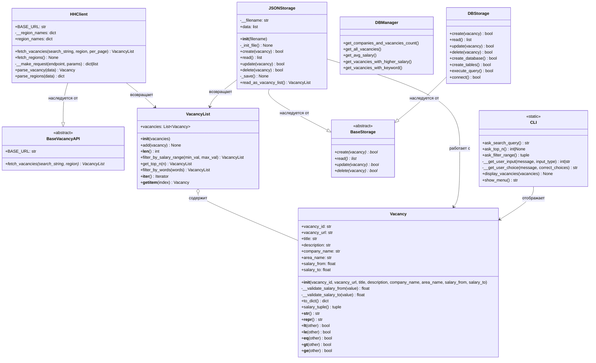

# Документация проекта: Агрегатор вакансий

## Описание проекта

Консольное приложение для поиска и управления вакансиями с платформы HeadHunter. Проект реализует паттерны
проектирования для работы с внешними API, хранением данных и пользовательским интерфейсом.

## Установка и запуск

```bash
# Клонирование репозитория
git clone https://github.com/dagniden/HHParser.git

# Установка зависимостей
poetry install

# Запуск приложения
python src/main.py
```

## Архитектура проекта

### Структура файлов

```
src/
├── main.py            # точка входа
├── vacancy_api.py     # BaseVacancyAPI, HHClient
├── models.py          # Vacancy, VacancyList
├── storage.py         # BaseStorage, JSONStorage, DBStorage
├── db_manager.py      # DBManager - бизнес-логика для БД
└── cli.py             # интерфейс пользователя

tests/
├── test_client.py
├── test_models.py
├── test_storage.py
└── test_cli.py

logs/
├── main.log
├── vacancy_api.log
├── storage.log
└── models.log
```

### Диаграмма классов



## API Reference

### Класс HHClient

---

Клиент для работы с API HeadHunter.

**Атрибуты:**

- `BASE_URL: str` — базовый URL API HeadHunter (`https://api.hh.ru`)
- `region_names: dict` — справочник регионов (только чтение)

**Методы:**

- `fetch_vacancies(search_string: str, region: int = 1, per_page: int = 5) -> VacancyList`

  Получает список вакансий по поисковому запросу.

  - `search_string` — ключевые слова для поиска
  - `region` — ID региона (по умолчанию 1 — Москва)
  - `per_page` — количество вакансий на странице (макс. 100)
  - **Возвращает:** объект `VacancyList` с найденными вакансиями

- `fetch_regions() -> None`

  Загружает справочник регионов России с кэшированием результата.

- `parse_vacancy(data: dict) -> Vacancy` *(статический)*

  Парсит данные вакансии из ответа API в объект `Vacancy`.

- `parse_regions(data: list[dict]) -> dict` *(статический)*

  Рекурсивно парсит иерархическую структуру регионов в плоский словарь.

**Пример использования:**

```python
from src.vacancy_api import HHClient

client = HHClient()
vacancies = client.fetch_vacancies("Python Developer", region=1, per_page=10)
print(f"Найдено вакансий: {len(vacancies)}")
```

---

### Класс Vacancy

Модель данных для представления вакансии с поддержкой сравнения по зарплате.

**Атрибуты:**

| Атрибут        | Тип   | Описание                                    |
|----------------|-------|---------------------------------------------|
| `vacancy_id`   | str   | Уникальный идентификатор                    |
| `vacancy_url`  | str   | Ссылка на вакансию                          |
| `title`        | str   | Название вакансии                           |
| `description`  | str   | Краткое описание                            |
| `company_name` | str   | Название компании                           |
| `area_name`    | str   | Регион                                      |
| `salary_from`  | float | Зарплата от (0 если не указана)             |
| `salary_to`    | float | Зарплата до (inf если не указана)           |

**Методы:**

- `to_dict() -> dict` — конвертирует объект в словарь для сериализации
- `salary_tuple() -> tuple` — возвращает кортеж `(salary_from, salary_to)` для сравнения
- Операторы сравнения: `<`, `<=`, `==`, `>`, `>=` — сравнивают вакансии по зарплатам

**Пример использования:**

```python
vacancy1 = Vacancy("123", "url1", "Python Dev", "desc", "Company A", "Moscow", 100000, 150000)
vacancy2 = Vacancy("124", "url2", "Java Dev", "desc", "Company B", "SPb", 120000, 180000)

print(vacancy1 < vacancy2)  # True (сравнение по зарплате)
print(vacancy1.to_dict())   # Словарь для сохранения
```

---

### Класс VacancyList

Контейнер для хранения и фильтрации коллекции вакансий.

**Атрибуты:**

- `vacancies: list[Vacancy]` — список объектов вакансий

**Методы:**

- `add(vacancy: Vacancy) -> None` 
  
  Добавляет вакансию в список.

- `__len__() -> int` 
  
  Возвращает количество вакансий.

- `filter_by_salary_range(min_val: float, max_val: float) -> VacancyList`
  
  Фильтрует вакансии по диапазону зарплат (изменяет текущий объект). Возвращает `self` для цепочки вызовов.

- `get_top_n(n: int) -> VacancyList`
  
  Оставляет только топ-N вакансий с наивысшей зарплатой (изменяет текущий объект). Возвращает `self` для цепочки вызовов.

- `filter_by_words(words: list[str]) -> VacancyList`
  
  Фильтрует вакансии по ключевым словам в названии или описании (изменяет текущий объект). Возвращает `self` для цепочки вызовов.

- `__iter__()` — поддержка итерации по вакансиям
- `__getitem__(index)` — доступ по индексу

**Пример использования:**

```python
from src.models import VacancyList

vacancy_list = VacancyList()
vacancy_list.add(vacancy1)
vacancy_list.add(vacancy2)

# Цепочка фильтров
vacancy_list.filter_by_salary_range(100000, 200000) \
            .filter_by_words(["Python", "Django"]) \
            .get_top_n(5)

for vacancy in vacancy_list:
    print(vacancy)
```

---

### `JSONStorage`

Реализация хранилища данных в формате JSON с поддержкой CRUD-операций.

**Атрибуты:**

- `data: list` — кэш данных из файла

**Методы:**

- `__init__(filename: str = "vacancies.json")`
  
  Инициализирует хранилище. Создает файл, если он не существует.

- `create(vacancy: Vacancy) -> bool`
  
  Сохраняет вакансию в файл. Проверяет на дубликаты по `vacancy_id`.
  - **Возвращает:** `True` если вакансия добавлена, `False` если дубликат

- `read() -> list`
  
  Читает все данные из файла в формате списка словарей.
  - **Возвращает:** список словарей с данными вакансий

- `update(vacancy: Vacancy) -> bool`
  
  Обновляет существующую вакансию по `vacancy_id`.
  - **Возвращает:** `True` если обновлено, `False` если не найдена

- `delete(vacancy: Vacancy) -> bool`
  
  Удаляет вакансию по `vacancy_id`.
  - **Возвращает:** `True` если удалена, `False` если не найдена

- `read_as_vacancy_list() -> VacancyList`
  
  Читает файл и возвращает объект `VacancyList` с объектами `Vacancy`. Преобразует строки `"inf"` в `float("inf")`.

**Пример использования:**

```python
from src.storage import JSONStorage
from src.models import Vacancy

storage = JSONStorage("my_vacancies.json")

# Добавление
vacancy = Vacancy("123", "url", "Title", "desc", "Company", "Moscow", 100000, 150000)
storage.create(vacancy)

# Чтение
vacancy_list = storage.read_as_vacancy_list()
print(f"Сохранено вакансий: {len(vacancy_list)}")

# Обновление
vacancy.salary_from = 120000
storage.update(vacancy)

# Удаление
storage.delete(vacancy)
```

---

### `CLI`

Класс для взаимодействия с пользователем через консоль (все методы статические).

**Методы:**

- `ask_search_query() -> str`
  
  Запрашивает у пользователя поисковый запрос.

- `ask_top_n() -> int | None`
  
  Спрашивает, нужно ли выводить топ-N вакансий. Возвращает число или `None`.

- `ask_filter_range() -> tuple[int | None, int | None]`
  
  Спрашивает о фильтрации по зарплате. Возвращает кортеж `(min_val, max_val)` или `(None, None)`.

- `display_vacancies(vacancies: list[Vacancy]) -> None`
  
  Выводит список вакансий в консоль.

- `show_menu() -> str`
  
  Показывает главное меню и возвращает выбранный пункт в виде строки.

**Пример использования:**

```python
from src.cli import CLI

query = CLI.ask_search_query()
top_n = CLI.ask_top_n()
min_sal, max_sal = CLI.ask_filter_range()

# Отображение результатов
CLI.display_vacancies(vacancy_list)
```

---

## Примечания

- Все методы фильтрации в `VacancyList` изменяют объект **in-place** и возвращают `self` для поддержки цепочки вызовов
- `JSONStorage` автоматически создает файл при инициализации
- Класс `Vacancy` использует `__slots__` для оптимизации памяти
- Все модули поддерживают логирование через `loguru`
## Логирование

Логи сохраняются в директории `logs/`:

- `main.log` — основные события приложения
- `vacancy_api.log` — запросы к API и парсинг данных

Уровень логирования: `DEBUG`

## Внешние API

### HeadHunter API

**Используемые эндпоинты:**

1. **Поиск вакансий:** `GET /vacancies`
   -
   Документация: [hh.ru/openapi/get-vacancies](https://api.hh.ru/openapi/redoc#tag/Poisk-vakansij/operation/get-vacancies)

2. **Справочник регионов:** `GET /areas`
   -
   Документация: [hh.ru/openapi/get-areas](https://api.hh.ru/openapi/redoc#tag/Obshie-spravochniki/operation/get-areas)

## Roadmap

- [ ] Базовая архитектура проекта на основе архитектуры HHParser


## Чек-лист требований

### Общие критерии для проекта

- [ ] Функциональный код разбит на модули: модуль для взаимодействия с API, модуль для взаимодействия с файлами, модуль для взаимодействия с вакансиями.
- [ ] Решение выложено на GitHub.
- [ ] В проекте есть .gitignore.
- [ ] В коммиты не добавлены игнорируемые файлы.
- [ ] В проекте есть файл с зависимостями.
- [ ] Нет грубых нарушений PEP 8 в оформлении кода.
- [ ] В проекте есть «точка входа» — модуль, запустив который можно получить результат всех реализованных в проекте функциональностей.
- [ ] Классы соответствуют минимум первым двум принципам SOLID.
- [ ] Все классы задокументированы.
- [ ] Все методы классов задокументированы.
- [ ] Все методы классов типизированы.

###  Работа по созданию базы данных и таблиц

- [ ] Реализован код автоматического создания БД.
- [ ] Код для создания БД вызывается в основном скрипте программы.
- [ ] Реализован код для создания таблиц в БД.
- [ ] Код для создания таблиц в БД вызывается в основном скрипте программы.
- [ ] Создается таблица для организаций.
- [ ] Создается таблица для вакансий.
- [ ] Таблица вакансий связана с таблицей организаций через FK.
- [ ] Использованы средства скрытия данных для доступа к БД.

### Заполнение данных

- [ ] Таблица организаций заполняется 10 записями о компаниях для сбора вакансий.
- [ ] Таблица вакансий заполняется записями о вакансиях компаний через запросы к hh.ru.

###  Взаимодействие с базой данных

- [ ] Реализован класс DBManager.
- [ ] Реализован метод получения списка всех компаний и количества вакансий у каждой компании.
- [ ] В методе используется SQL-запрос, выводящий информацию о вакансиях и компаниях через JOIN.
- [ ] Реализован метод получения списка всех вакансий с указанием названия компании, названия вакансии, зарплаты и ссылки на вакансию.
- [ ] В методе используется SQL-запрос, выводящий информацию о вакансиях и компаниях через JOIN.
- [ ] Реализован метод получения средней зарплаты по вакансиям.
- [ ] В методе используется SQL-запрос, выводящий информацию о средней зарплате через функцию AVG.
- [ ] Реализован метод получения списка всех вакансий, у которых зарплата выше средней по всем вакансиям.
- [ ] В методе используется SQL-запрос, выводящий информацию о средней зарплате через фильтрацию WHERE.
- [ ] Реализован метод получения списка всех вакансий, в названии которых содержатся переданные в метод слова, например python.
- [ ] В методе используется SQL-запрос, выводящий список всех вакансий, в названии которых содержатся переданные в метод слова через оператор LIKE.

###  Интерфейс управления


- [ ] Создана функция взаимодействия с пользователем.
- [ ] Функция использует экземпляры классов и их методы, реализованные ранее.
- [ ] Не дублируется функциональность, реализованная в классах.
- [ ] Интерфейс взаимодействия с пользователем реализован понятным текстом, т. е. в выводе не используются коллекции, только человекочитаемые строки.
- [ ] Функция взаимодействия с пользователем не перегружена.


### Тестирование

- [ ] Написаны тесты для функциональностей проекта.
- [ ] Общее покрытие функционального кода — более 70%.

## Зависимости

```
requests>=2.31.0
loguru>=0.7.0
```