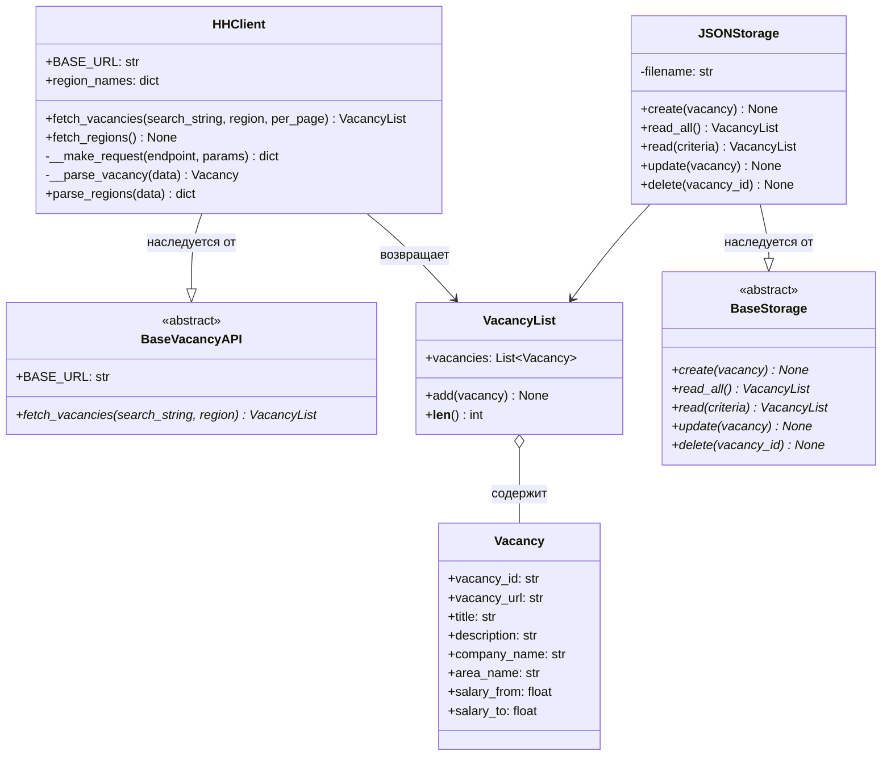

# Документация проекта: Агрегатор вакансий

## Описание проекта

Консольное приложение для поиска и управления вакансиями с платформы HeadHunter. Проект реализует паттерны
проектирования для работы с внешними API, хранением данных и пользовательским интерфейсом.

## Установка и запуск

```bash
# Клонирование репозитория
git clone https://github.com/dagniden/HHParser.git

# Установка зависимостей
poetry install

# Запуск приложения
python src/main.py
```

## Архитектура проекта

### Структура файлов

```
src/
├── main.py            # точка входа в программу
├── vacancy_api.py     # BaseVacancyAPI, HHClient
├── models.py          # Vacancy, VacancyList
├── storage.py         # BaseStorage (CRUD), JSONStorage
└── cli.py             # интерфейс пользователя (консоль)

tests/
├── test_client.py
├── test_models.py
├── test_storage.py
└── test_cli.py

logs/
├── main.log
└── vacancy_api.log
```

### Диаграмма классов



## API Reference

### `HHClient`

Клиент для работы с API HeadHunter.

**Методы:**

- `fetch_vacancies(search_string: str, region: int = 1, per_page: int = 5) -> VacancyList`

  Получает список вакансий по поисковому запросу.

    - `search_string` — ключевые слова для поиска
    - `region` — ID региона (по умолчанию 1 — Москва)
    - `per_page` — количество вакансий на странице (макс. 100)

- `fetch_regions() -> None`

  Загружает справочник регионов России с кэшированием результата.

**Пример использования:**

```python
from src.vacancy_api import HHClient

client = HHClient()
vacancies = client.fetch_vacancies("Python Developer", region=1, per_page=10)
```

### `Vacancy`

Модель данных для представления вакансии.

**Атрибуты:**

| Атрибут        | Тип        | Описание                 |
|----------------|------------|--------------------------|
| `vacancy_id`   | str        | Уникальный идентификатор |
| `vacancy_url`  | str        | Ссылка на вакансию       |
| `title`        | str        | Название вакансии        |
| `description`  | str        | Краткое описание         |
| `company_name` | str        | Название компании        |
| `area_name`    | str        | Регион                   |
| `salary_from`  | float/None | Зарплата от              |
| `salary_to`    | float/None | Зарплата до              |

### `VacancyList`

Контейнер для хранения коллекции вакансий.

**Методы:**

- `add(vacancy: Vacancy) -> None` — добавить вакансию
- `__len__() -> int` — получить количество вакансий

**Запланированные методы:**

- `filter_by_salary(min: float, max: float) -> VacancyList`
- `top_n(n: int) -> VacancyList`

### `JSONStorage`

Реализация хранилища данных в формате JSON.

**Методы (запланированные):**

- `create(vacancy: Vacancy)` — сохранить вакансию
- `read_all() -> VacancyList` — получить все вакансии
- `read(criteria: dict) -> VacancyList` — поиск по критериям
- `update(vacancy: Vacancy)` — обновить вакансию
- `delete(vacancy_id: str)` — удалить вакансию

## Логирование

Логи сохраняются в директории `logs/`:

- `main.log` — основные события приложения
- `vacancy_api.log` — запросы к API и парсинг данных

Уровень логирования: `DEBUG`

## Внешние API

### HeadHunter API

**Используемые эндпоинты:**

1. **Поиск вакансий:** `GET /vacancies`
    -
    Документация: [hh.ru/openapi/get-vacancies](https://api.hh.ru/openapi/redoc#tag/Poisk-vakansij/operation/get-vacancies)

2. **Справочник регионов:** `GET /areas`
    -
    Документация: [hh.ru/openapi/get-areas](https://api.hh.ru/openapi/redoc#tag/Obshie-spravochniki/operation/get-areas)

## Roadmap

- [x] Базовая архитектура проекта
- [x] Интеграция с HeadHunter API
- [x] Модели данных `Vacancy` и `VacancyList`
- [x] Парсинг ответов API
- [x] Справочник регионов с кэшированием
- [ ] Сравнение вакансий
- [ ] Реализация `JSONStorage`
- [ ] Фильтрация по зарплате
- [ ] Консольный интерфейс (CLI)
- [ ] Полное покрытие тестами

## Зависимости

```
requests>=2.31.0
loguru>=0.7.0
```

## Лицензия

[Указать лицензию проекта]