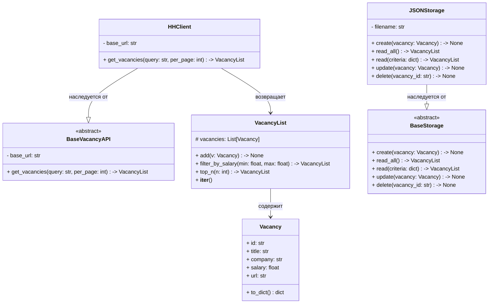

# Структура проекта
```
src/
├── main.py            # точка входа в программу
├── vacancy_api.py     # BaseVacancyAPI, HHClient
├── models.py          # Vacancy, VacancyList
├── storage.py         # BaseStorage (CRUD), JSONStorage
└── cli.py             # интерфейс пользователя (консоль)

tests/
├── test_client.py
├── test_models.py
├── test_storage.py
└── test_cli.py

logs/
├── main.log
└── vacancy_api.log

```
# Диаграмма классов


# Справочная информация по API HH

1. Описание эндпоинта получения вакансий:
https://api.hh.ru/openapi/redoc#tag/Poisk-vakansij/operation/get-vacancies

2. Описание Дерево всех регионов
https://api.hh.ru/openapi/redoc#tag/Obshie-spravochniki/operation/get-areas


# Todo

- [x] Спроектировать структуру проекта
- [x] Спроектировать классы
- [x] Сделать класс HHClient
- [x] Сделать классы с моделями
- [x] Сделать парсинг ответа от HH в модель Vacancy
- [x] Наполнить VacancyList объектами Vacancy
- [ ] Добавить модель Region
- [ ] Добавить список регионов в HHClient и его наполнение методом get_areas

