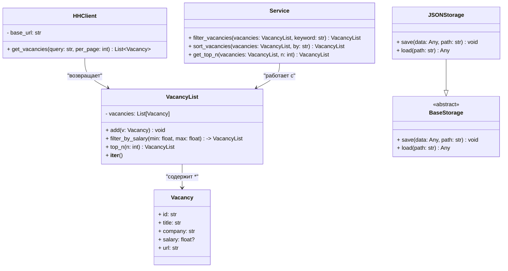

# Структура проекта
```
src/
├── main.py            # точка входа в программу
├── vacancy_api.py     # классы: BaseVacancyAPI, HHClient
├── models.py          # классы: Vacancy, VacancyList
├── storage.py         # классы: BaseStorage, JSONStorage
├── services.py        # функции фильтрации, сортировки, топ N
└── cli.py             # взаимодействие с пользователем (консоль)

tests/
├── test_client.py
├── test_models.py
├── test_storage.py
└── test_services.py

logs/
├── main.log
└── test_services.py
```
# Диаграмма классов


# Справочная информация по API HH

1. Описание эндпоинта получения вакансий:
https://api.hh.ru/openapi/redoc#tag/Poisk-vakansij/operation/get-vacancies

2. Описание Дерево всех регионов
https://api.hh.ru/openapi/redoc#tag/Obshie-spravochniki/operation/get-areas